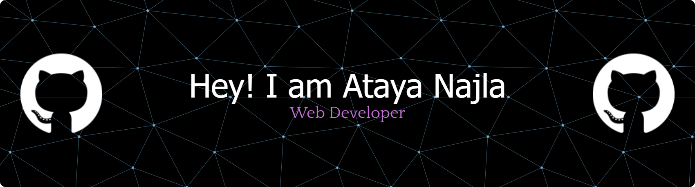

## Hi World! I'm Ataya Najla 👋

💻 Web Developer | 🚀 Tech Explorer | 📱 Interested in Web & Mobile Development

<!--
**Atayanajla/Atayanajla** is a ✨ _special_ ✨ repository because its `README.md` (this file) appears on your GitHub profile.

Here are some ideas to get you started:

- 🔭 I’m currently working on ...
- 🌱 I’m currently learning ...
- 👯 I’m looking to collaborate on ...
- 🤔 I’m looking for help with ...
- 💬 Ask me about ...
- 📫 How to reach me: ...
- 😄 Pronouns: ...
- ⚡ Fun fact: ...
-->

### 💬 About Me

<!-- - 🔭 I’m currently exploring : Web & Mobile Development -->
- 🌱 I’m currently learning: Backend development with Python
<!-- - ⚡ Fun fact: Watching anime and playing games in my free time 🎮 -->

### 🛠️ Tech Stack

  

<b>Other</b>

 
 
 
 
 
 
   
 
 
 

 

 

---

### 📫 How to reach me

  
  
  

<!-- ### 📊 GitHub Activity

<picture>
  <source media="(prefers-color-scheme: dark)" srcset="https://raw.githubusercontent.com/atayanajla/atayanajla/output/pacman-contribution-graph-dark.svg">
  <source media="(prefers-color-scheme: light)" srcset="https://raw.githubusercontent.com/atayanajla/atayanajla/output/pacman-contribution-graph.svg">
  
</picture> -->